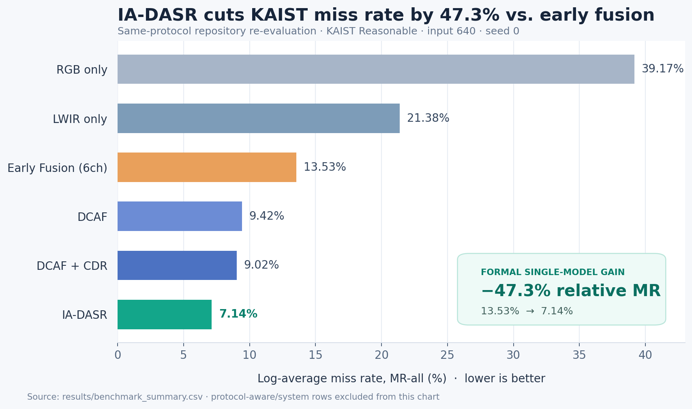
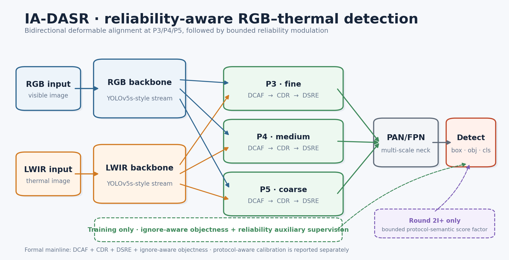
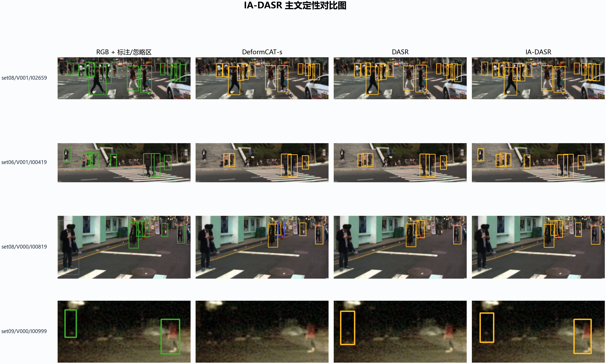

<div align="center">

# IA-DASR

### 面向 RGB-T 行人检测的忽略区域感知、可变形对齐与场景可靠性学习

**[English](README.md) · [方法](docs/ARCHITECTURE.md) ·
[结果](docs/BENCHMARKS.md) · [复现](docs/REPRODUCIBILITY.md) ·
[模型卡](model_cards/)**

</div>

IA-DASR 是一个双流 RGB-热红外行人检测项目，重点处理三类真实问题：
双传感器空间错位、昼夜条件下模态可靠性变化，以及 KAIST 标注协议中的
ignore/non-countable 区域。模型在 YOLOv5 风格双流检测器中加入三尺度双向
可变形跨模态注意力、共识/细节精炼、场景可靠性调制与 ignore-aware 监督。

这个仓库以“结果可审计”为原则重新整理。首页的每个数字都在
[`results/benchmark_summary.csv`](results/benchmark_summary.csv) 中记录了
实验 setting、协议、证据等级、来源和声明边界；正式单模型、协议优化单
checkpoint、路由系统和后处理结果不会混写。

> **边界说明：** 检测器本体不是 LLM，也不是语言条件视觉模型。仓库新增的
> [LLM 实验助手](docs/LLM_COPILOT.md) 只负责读取已验证结果并生成结构化报告/
> 简历草稿，不参与检测推理，也不会把该项目包装成“LLM 检测器”。

## 核心结果

KAIST 使用 log-average Miss Rate（MR，越低越好）。下表七行均来自本仓库
同一份 Reasonable 协议重评汇总，输入 `640`、seed `0`。

| 方法 | 口径 | MR-all ↓ | MR-day ↓ | MR-night ↓ | mAP@.5 ↑ |
|---|---|---:|---:|---:|---:|
| YOLOv5s RGB-only | 单模型 | 39.174 | 31.675 | 53.602 | 51.072 |
| YOLOv5s LWIR-only | 单模型 | 21.383 | 26.525 | 10.302 | 67.217 |
| Early Fusion 6-channel | 单模型 | 13.535 | 15.362 | 8.820 | 75.923 |
| DCAF | 单模型 | 9.416 | 10.694 | 6.456 | **78.391** |
| DCAF + CDR | 单模型 | 9.017 | 10.418 | 5.209 | 77.096 |
| DCAF + CDR + DSRE | 单模型 | 9.055 | 10.164 | 6.358 | 77.473 |
| **IA-DASR 正式主线** | **单模型** | **7.137** | **7.917** | **4.159** | 71.741 |

正式 IA-DASR 相比同协议六通道 Early Fusion 的 MR-all 从 `13.535%`
降至 `7.137%`，相对下降 **47.3%**。

不同口径的更优系统单独列示：

| 方法/系统 | 口径 | MR-all ↓ | MR-day ↓ | MR-night ↓ | 必须保留的边界 |
|---|---|---:|---:|---:|---|
| **IA-DASR Round 2I+** | 协议优化单 checkpoint | **6.909** | **7.370** | 4.844 | 含 KAIST ROI、夜间校准与有界 PCSF |
| IA-DASR + IAER | 路由系统 | 6.900 | 7.620 | **4.190** | 多专家路由，不是单检测器 |
| IA-DASR + IAER + ECR | 后处理系统 | 6.841 | 7.429 | 4.276 | prediction-only 校准重排 |

Round 2I+ 官方 reload/fused 复评还得到 `Recall-all = 98.42%`。由于它含
KAIST-specific inference 开关，简历中应表述为
“protocol-optimized single checkpoint”，不能表述为通用跨数据集能力。



## 方法概览



1. **DCAF：** 在 P3/P4/P5 三个尺度做双向局部可变形采样与跨模态注意力，
   降低 RGB/LWIR 不完全配准带来的误差。
2. **CDR：** 显式拆分两模态的共识信息与细节信息，避免直接拼接或平均。
3. **DSRE：** 建模前景支持、模态冲突、局部细节、歧义与场景上下文，通过
   有界残差方式调节融合特征。
4. **Ignore-aware objectness：** ignore 区域不再被当作负样本强行惩罚。
5. **Round 2I+：** 额外预测协议语义分量并做弱、有界分数校准；因其协议
   特化属性，与正式主线分开报告。

完整方法、公式和原创/上游边界见
[`docs/ARCHITECTURE.md`](docs/ARCHITECTURE.md)。

## 定性结果

下图依次展示 RGB + GT、DeformCAT 风格基线、DASR 和 IA-DASR 的精选对比。
定性图仅用于理解典型案例，完整测试集数字以上述结果表为准。



## 快速开始

```bash
git clone https://github.com/drxadqz/kaist_yolo.git
cd kaist_yolo
python -m venv .venv
# Windows: .venv\Scripts\activate
# Linux/macOS: source .venv/bin/activate
python -m pip install --upgrade pip
python -m pip install -r requirements.txt
```

本仓库不分发 KAIST 图像和训练标签。请从
[KAIST 官方项目](https://github.com/SoonminHwang/rgbt-ped-detection)
取得相应材料，准备好图像、sanitized train annotations 和官方 test
annotations 后运行。仓库中为兼容公开评测而保留的 annotation JSON 和精选
定性拼图按 KAIST 数据资产处理，单独遵循 CC BY-NC-SA 4.0；详见
[`docs/DATASET.md`](docs/DATASET.md) 与
[`THIRD_PARTY_NOTICES.md`](THIRD_PARTY_NOTICES.md)。

```bash
python src/setup_local_kaist.py \
  --image-source-root /path/to/kaist_yolo_images \
  --train-annotation-root /path/to/sanitized_train_annotations \
  --test-annotation-root /path/to/official_test_annotations \
  --target-root datasets/KAIST_local_strict
```

无需数据和权重即可先验证两个模型图：

```bash
python src/models/yolo_test.py \
  --cfg configs/models/ia_dasr_formal.yaml \
  --device cpu

python src/models/yolo_test.py \
  --cfg configs/models/ia_dasr_round2i_plus.yaml \
  --device cpu
```

正式主线的已验证运行是从 stage-1 IA-DASR checkpoint 继续训练 10 个 epoch，
不是 10 epoch 从零训练。把兼容权重放到
`checkpoints/ia_dasr_stage1_best.pt`：

```bash
python src/train.py \
  --weights checkpoints/ia_dasr_stage1_best.pt \
  --cfg configs/models/ia_dasr_formal.yaml \
  --data configs/datasets/kaist.example.yaml \
  --hyp configs/experiments/hyp.formal_stage2.yaml \
  --epochs 10 \
  --batch-size 1 \
  --img-size 640 640 \
  --workers 0 \
  --kaist-day-roi-filter \
  --kaist-ignore-aware-obj \
  --drr-aux-weight 0.03
```

历史 stage-1 checkpoint 目前尚未公开，因此这条命令能重建记录的 recipe，但
干净 clone 暂时不能保证从头产出 headline checkpoint。这个缺口已在模型卡和
复现文档中明确记录。

权重不再作为普通 Git blob 提交。把验证过的 checkpoint 放到
`checkpoints/ia_dasr_stage2_e10_best.pt`，然后执行：

```bash
python src/test.py \
  --weights checkpoints/ia_dasr_stage2_e10_best.pt \
  --data configs/datasets/kaist.example.yaml \
  --img-size 640 \
  --batch-size 2 \
  --device 0 \
  --kaist-day-roi-filter
```

数据目录约定、完整复现命令、checkpoint hash 和协议优化参数分别见
[`docs/DATASET.md`](docs/DATASET.md)、
[`docs/REPRODUCIBILITY.md`](docs/REPRODUCIBILITY.md) 和
[`checkpoints/README.md`](checkpoints/README.md)。

## LLM 实验助手

离线模式只读取 canonical CSV，不联网、不需要 key：

```bash
python scripts/experiment_copilot.py \
  --input-csv results/benchmark_summary.csv \
  --format context-json \
  --output outputs/experiment_context.json
```

可选的 structured-output LLM 模式：

```bash
python -m pip install -r requirements-llm.txt
# 在进程环境中设置 OPENAI_API_KEY，不要写入仓库。
python scripts/experiment_copilot.py \
  --call-openai \
  --model gpt-5.6-luna \
  --output outputs/experiment_report.json
```

它会把 `single_model / protocol_optimized / system / postprocess` 分开，并在
提示词层面禁止将后三者改写成正式单模型声明。

## 面向大模型岗位的真实能力映射

这个项目可以真实体现：

- 多模态表征学习与 cross-modal attention；
- 双传感器对齐、冲突建模与 modality reliability；
- 类 MoE 的条件路由与系统级组合；
- 噪声/忽略标注下的结构化监督；
- protocol-aware evaluation、错误分类与 hard-case 分析；
- PyTorch 研究工程、结果溯源、模型卡和自动化测试；
- 基于结构化输出的 evidence-grounded LLM 实验工具。

它不能被写成“开发了 LLM/VLM 检测器”。直接的大模型后训练证据应由
[SP-WFM](https://github.com/drxadqz/SP-WFM) 承担：该仓库包含 Qwen2.5、
QLoRA、SFT/GRPO 与 learned expert router。

## 仓库整理说明

远程旧版的 01–06 YOLO/MOT 原型已从当前树移除，但仍能从 Git 历史恢复。
其中 late-fusion、mid-fusion 与 tracking 缺乏足以支撑首页结论的正式证据，
因此没有被包装成已验证提升。详见 [`legacy/README.md`](legacy/README.md)。

当前树不提交数据集、全量 runs、raw checkpoint、登录态、数据库、论文私稿
或本机绝对路径。删除当前树里的历史权重不会自动减小旧 Git 历史；仓库历史
改写属于破坏性操作，本次没有执行。

## 许可证

代码以 [AGPL-3.0](LICENSE) 发布，并基于
[DeformCAT](https://github.com/jiongger/DeformCAT) 与
[YOLOv5](https://github.com/ultralytics/yolov5) 代码体系。原创贡献与上游
归属见 [`docs/ATTRIBUTION.md`](docs/ATTRIBUTION.md)。引用信息见
[`CITATION.cff`](CITATION.cff)。
